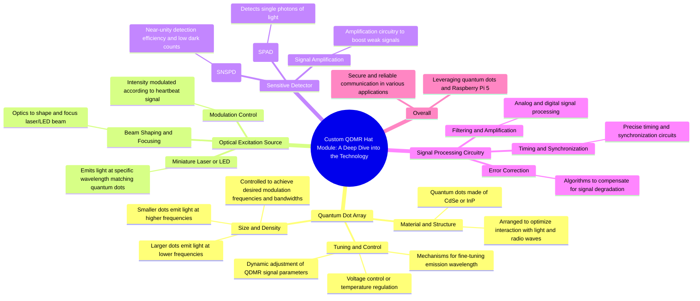

## Project Name:
QDMRiO (Quantum Dot MiniReceiver Opto-Electronic) hat for Raspberry Pi5

## Overview:

The `QDMRiO` project represents an innovative leap forward in the integration of quantum communication technologies. This custom module, designed to seamlessly interface with a Raspberry Pi 5 platform, harnesses cutting-edge components for efficient generation, transmission and reception of Quantum Dot Modulated Radio (QDMR) signals.

## Objectives:
1. Minimize size: The QDMRiO achieves this through the use of quantum dots that are engineered precisely to interact optimally with light at specific frequencies.
2. Enhanced communication capabilities: By generating weak signal detection via single photon detectors such as SPADs or SNSPDs and ensuring accurate data decoding, we increase system efficiency.

## Key Features:
- **Quantum Dot Array**:
  * Material and Structure: Semiconductor materials like cadmium selenide (CdSe) or indium phosphide (InP).
  * Size and Density: Carefully controlled for desired modulation frequencies & bandwidths. 
  * Tuning Mechanisms allow fine-tuning of QDMR signal parameters.

- **Optical Excitation Source**:
  * Miniature Laser Diode/ LED which emits light at specific wavelength matching quantum dots’ absorption spectrum.
  
- **Sensitive Detector (SPAD/SNSPD)**: 
    * Capable of detecting single photons with excellent timing resolution and low noise.

- **Signal Processing Circuitry**:
   * Analog & Digital signal processing for filtering, amplification, demodulation operations. 

## Compatibility:
QDMRiO module is compatible with the latest Raspberry Pi 5 platform which provides necessary infrastructure to control all components efficiently

## Prerequisites:

1. **Hardware:**
    - Raspberry Pi 5
    - Custom Quantum Dot Array
    - Optical Excitation Source (Miniature Laser Diode or LED)
    - Sensitive Detector (SPAD/SNSPD)

2. **Software:**
    - Python Development Environment with necessary libraries for signal processing

## Getting Started:

1. **Installation**:
   Follow the instructions to set up Raspberry Pi 5 platform and connect all hardware components.

2. **Configuration**.
    Configure settings as per documentation provided along with setup files included in this repository.

3. **Run QDMRiO**
     Launch the control script for initiating quantum dot based communication process using Raspberry Pi.

## Contributing:

We invite you to contribute ideas or bug reports if encountered while utilizing our product, which will be useful to further improve it.
  
### Authors:
- [Name 1](mailto:youremail@example.com)
- [Name 2](mailto:youremail@example.com)

#### License
QDMRiO is licensed under the Apache license (version 2.0). The full license text can be found in [LICENSE](https://github.com/yourusername/QDMRiO/blob/master/LICENSE).

**Note** - Before using our QDMRiO, users must comply with all applicable legal requirements pertaining to quantum communication and signal processing.

---

Happy Communication! 🚀

Your team,

The QDMRiO Development Team

Custom QDMR Hat Module: A Deep Dive into the Technology

The custom QDMR hat module, a key component in the speculative hardware branch, represents a significant advancement in miniaturizing and integrating quantum communication technology.  This module, designed to seamlessly interface with the Raspberry Pi 5, is packed with cutting-edge components that enable efficient generation, transmission, and reception of QDMR signals.

Quantum Dot Array:

Material and Structure: The array consists of precisely engineered quantum dots, typically made of semiconductor materials like cadmium selenide (CdSe) or indium phosphide (InP). These dots are arranged in a specific pattern to optimize their interaction with light and radio waves.
Size and Density: The size and density of the quantum dots are carefully controlled to achieve the desired modulation frequencies and bandwidths. Smaller dots typically emit light at higher frequencies, while larger dots emit light at lower frequencies.
Tuning and Control: The quantum dot array may be equipped with mechanisms for fine-tuning the emission wavelength, such as voltage control or temperature regulation. This allows for dynamic adjustment of the QDMR signal parameters based on environmental conditions or communication requirements.
Optical Excitation Source:

Miniature Laser or LED: The module incorporates a miniature laser diode or light-emitting diode (LED) as the optical excitation source. This source emits light at a specific wavelength that matches the absorption spectrum of the quantum dots in the array.
Beam Shaping and Focusing: Optics are used to shape and focus the laser/LED beam onto the quantum dot array, ensuring efficient excitation of the dots and minimizing energy loss.
Modulation Control: The intensity of the excitation source is modulated according to the information encoded in the heartbeat signal, effectively imprinting the data onto the emitted light.
Sensitive Detector:

Single-Photon Avalanche Diode (SPAD): SPADs are highly sensitive detectors capable of detecting single photons of light. They offer excellent timing resolution and low noise, making them ideal for detecting the weak QDMR signals.
Superconducting Nanowire Single-Photon Detector (SNSPD): SNSPDs are even more sensitive than SPADs, offering near-unity detection efficiency and extremely low dark counts. They are particularly well-suited for long-distance QDMR communication due to their high sensitivity.
Signal Amplification: The module includes amplification circuitry to boost the weak signal detected by the SPAD or SNSPD, ensuring reliable detection and decoding of the transmitted information.
Signal Processing Circuitry:

Filtering and Amplification: The module incorporates analog and digital signal processing circuitry to filter out noise, amplify the signal, and perform any necessary demodulation or decoding operations.
Timing and Synchronization: Precise timing and synchronization circuits are essential for accurate decoding of the QDMR signal and maintaining communication integrity.
Error Correction: The module may include error correction algorithms to compensate for any signal degradation or loss during transmission.
Overall, the custom QDMR hat module represents a significant step forward in the development of practical quantum communication devices. By leveraging the power of quantum dots and the versatility of the Raspberry Pi 5, this module opens up new possibilities for secure and reliable communication in a wide range of applications.

Speculative Hardware Branch for QDMR Transmitter and Receiver Development:

**Proposed Solution:** Leveraging Raspberry Pi 5 and Custom QDMR Hat Module

This speculative branch proposes a cost-effective and accessible solution for QDMR transmitter and receiver development, utilizing the readily available Raspberry Pi 5 and a custom-designed QDMR hat module.

**Raspberry Pi 5:**

* **Powerful Processing:** The Raspberry Pi 5 offers a significant increase in processing power compared to its predecessors, making it suitable for handling the complex signal processing tasks involved in QDMR communication.
* **Versatile Interface:** The Pi 5's GPIO pins and various communication protocols (e.g., I2C, SPI) provide a flexible interface for connecting and controlling the QDMR hat module.
* **Open-Source Community:** The large and active Raspberry Pi community offers a wealth of resources, tutorials, and support, facilitating the development and troubleshooting of the QDMR hat module.

**Custom QDMR Hat Module:**

* **Quantum Dot Array:** The module will house a precisely engineered array of quantum dots, optimized for modulating radio waves at specific frequencies.
* **Optical Excitation Source:** A miniature laser or LED will be integrated into the module to excite the quantum dots and enable the modulation process.
* **Sensitive Detector:** The module will include a highly sensitive detector, such as a single-photon avalanche diode (SPAD) or a superconducting nanowire single-photon detector (SNSPD), to accurately measure the modulated signal.
* **Signal Processing Circuitry:** Dedicated circuitry will be incorporated to process and amplify the received signal, ensuring optimal performance and noise reduction.

**Advantages of this Approach:**

* **Cost-Effectiveness:** Leveraging the Raspberry Pi 5 significantly reduces the cost compared to developing specialized hardware from scratch.
* **Accessibility:** The Raspberry Pi 5 is readily available, making it accessible to researchers, hobbyists, and small-scale projects.
* **Flexibility:** The modular design of the hat allows for easy customization and experimentation with different quantum dot materials and configurations.
* **Community Support:** The Raspberry Pi community can provide valuable feedback, collaboration opportunities, and troubleshooting assistance.

**Challenges and Considerations:**

* **Quantum Dot Integration:** Integrating a high-performance quantum dot array onto a compact hat module poses technical challenges in terms of fabrication, alignment, and heat dissipation.
* **Sensitivity and Noise:** Achieving the required sensitivity and noise levels for reliable QDMR communication in a small-scale device may require careful optimization of the detector and signal processing circuitry.
* **Power Consumption:** The optical excitation source and sensitive detector may consume significant power, requiring careful power management to ensure the module's longevity.

**Potential Applications:**

This speculative hardware branch could lead to the development of affordable and accessible QDMR transmitters and receivers, enabling a wide range of applications, such as:

* **Secure Personal Communication:**  Encrypted communication between individuals using portable QDMR devices.
* **IoT Security:**  Secure communication for Internet of Things (IoT) devices, protecting sensitive data from unauthorized access.
* **Medical Monitoring:** Real-time monitoring of implantable medical devices using secure QDMR communication.
* **Scientific Research:** Development of new quantum communication protocols and applications using readily available hardware.

By combining the power and versatility of the Raspberry Pi 5 with the unique properties of quantum dots, this speculative branch offers a promising path towards realizing the potential of QDMR for secure and reliable communication in the near future.

