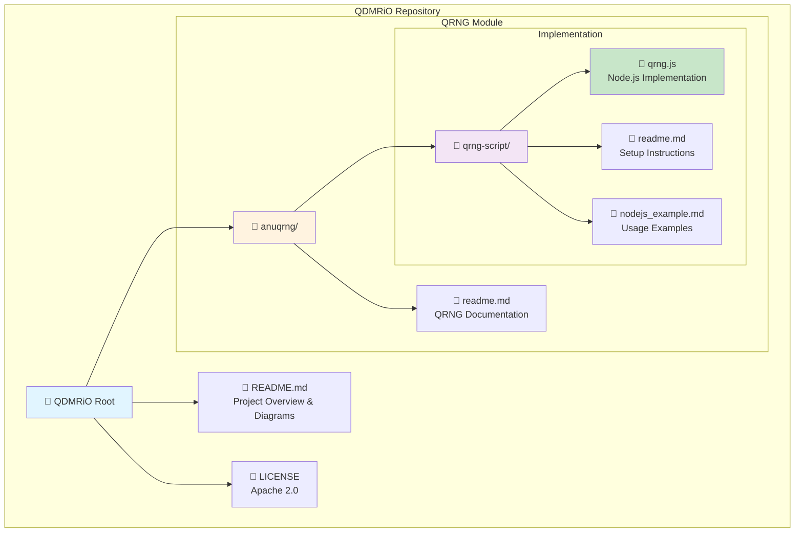
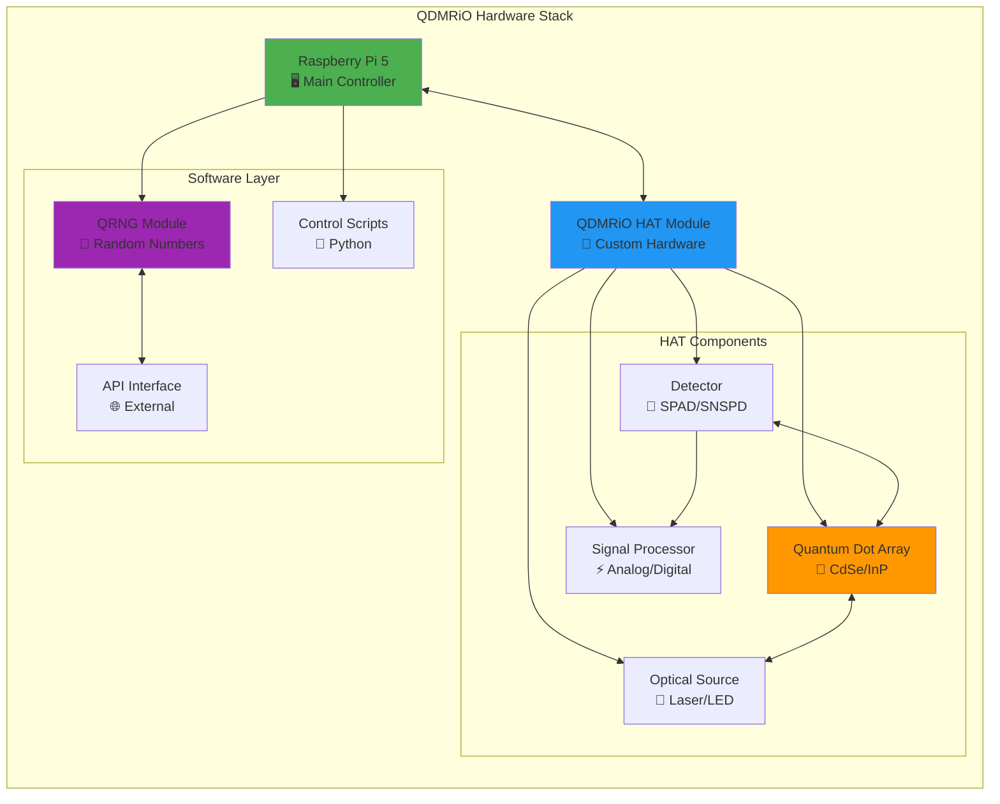
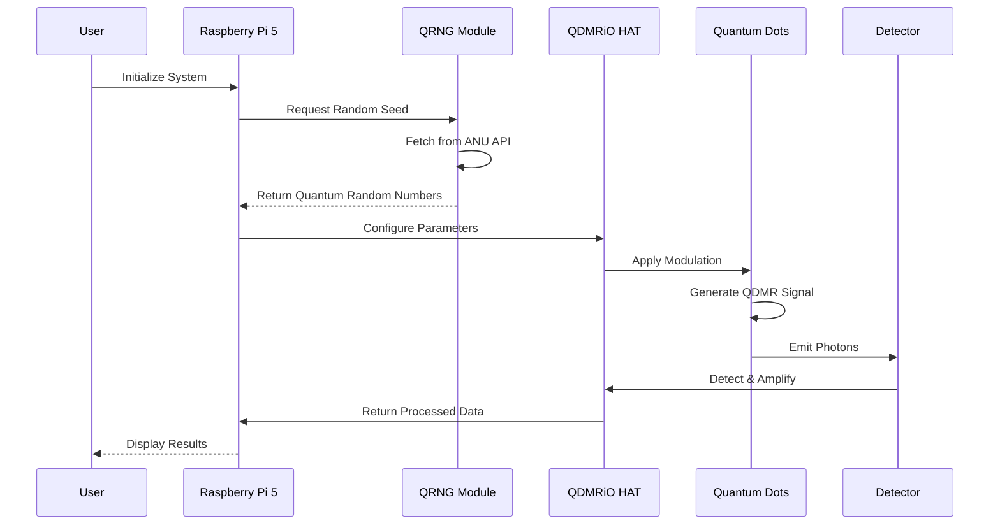
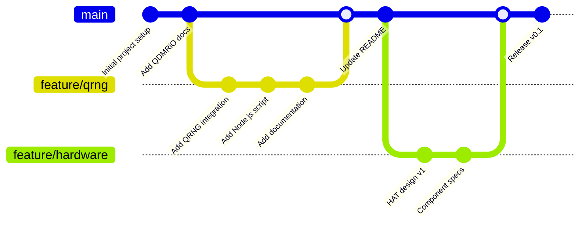
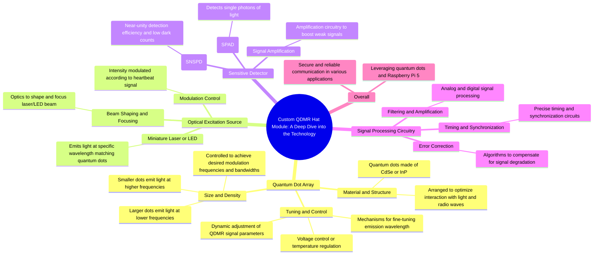

# QDMRiO
## Quantum Dot MiniReceiver Opto-Electronic Hat for Raspberry Pi 5

[](LICENSE)

## Overview

The `QDMRiO` project represents an innovative leap forward in quantum communication technologies. This custom HAT module interfaces with Raspberry Pi 5 to enable Quantum Dot Modulated Radio (QDMR) signal generation, transmission, and reception.

### Quick Links
- [Repository Structure](#repository-structure)
- [System Architecture](#system-architecture)
- [QRNG Integration](./anuqrng/readme.md)
- [Getting Started](#getting-started)
- [Technical Details](#technical-details)

---

## Repository Structure


```mermaid
graph TB
    subgraph "QDMRiO Repository"
        ROOT[📁 QDMRiO Root]
        README[📄 README.md<br/>Project Overview & Diagrams]
        LICENSE[📄 LICENSE<br/>Apache 2.0]

        subgraph "QRNG Module"
            ANUDIR[📁 anuqrng/]
            ANUREADME[📄 readme.md<br/>QRNG Documentation]

            subgraph "Implementation"
                SCRIPTDIR[📁 qrng-script/]
                QRNGJS[📄 qrng.js<br/>Node.js Implementation]
                SCRIPTREADME[📄 readme.md<br/>Setup Instructions]
                EXAMPLE[📄 nodejs_example.md<br/>Usage Examples]
            end
        end
    end

    ROOT --> README
    ROOT --> LICENSE
    ROOT --> ANUDIR
    ANUDIR --> ANUREADME
    ANUDIR --> SCRIPTDIR
    SCRIPTDIR --> QRNGJS
    SCRIPTDIR --> SCRIPTREADME
    SCRIPTDIR --> EXAMPLE

    style ROOT fill:#e1f5ff
    style ANUDIR fill:#fff3e0
    style SCRIPTDIR fill:#f3e5f5
    style QRNGJS fill:#c8e6c9
```

---

## System Architecture


```mermaid
graph LR
    subgraph "QDMRiO Hardware Stack"
        RPI5[Raspberry Pi 5<br/>🖥️ Main Controller]
        HAT[QDMRiO HAT Module<br/>🔧 Custom Hardware]

        subgraph "HAT Components"
            QDA[Quantum Dot Array<br/>💎 CdSe/InP]
            LASER[Optical Source<br/>🔦 Laser/LED]
            DET[Detector<br/>📡 SPAD/SNSPD]
            SIG[Signal Processor<br/>⚡ Analog/Digital]
        end

        subgraph "Software Layer"
            QRNG[QRNG Module<br/>🎲 Random Numbers]
            CTRL[Control Scripts<br/>🐍 Python]
            API[API Interface<br/>🌐 External]
        end
    end

    RPI5 <--> HAT
    HAT --> QDA
    HAT --> LASER
    HAT --> DET
    HAT --> SIG

    QDA <--> LASER
    DET <--> QDA
    DET --> SIG

    RPI5 --> QRNG
    RPI5 --> CTRL
    QRNG <--> API

    style RPI5 fill:#4caf50
    style HAT fill:#2196f3
    style QDA fill:#ff9800
    style QRNG fill:#9c27b0
```

---

## Component Interaction Flow


```mermaid
sequenceDiagram
    participant User
    participant RPI5 as Raspberry Pi 5
    participant QRNG as QRNG Module
    participant HAT as QDMRiO HAT
    participant QD as Quantum Dots
    participant Det as Detector

    User->>RPI5: Initialize System
    RPI5->>QRNG: Request Random Seed
    QRNG->>QRNG: Fetch from ANU API
    QRNG-->>RPI5: Return Quantum Random Numbers

    RPI5->>HAT: Configure Parameters
    HAT->>QD: Apply Modulation
    QD->>QD: Generate QDMR Signal
    QD->>Det: Emit Photons
    Det->>HAT: Detect & Amplify
    HAT->>RPI5: Return Processed Data
    RPI5-->>User: Display Results
```

---

## Key Features

### Quantum Dot Array
- **Materials**: CdSe (Cadmium Selenide) or InP (Indium Phosphide)
- **Configuration**: Optimized for specific modulation frequencies
- **Control**: Voltage/temperature tuning for dynamic adjustment

### Optical Excitation Source
- **Type**: Miniature Laser Diode or LED
- **Wavelength**: Matched to quantum dot absorption spectrum
- **Modulation**: Intensity-based data encoding

### Sensitive Detector
- **SPAD**: Single-Photon Avalanche Diode for timing-critical applications
- **SNSPD**: Superconducting Nanowire for maximum sensitivity
- **Performance**: Near-unity detection efficiency, low dark counts

### Signal Processing
- **Filtering**: Analog and digital noise reduction
- **Synchronization**: Precise timing circuits
- **Error Correction**: Signal degradation compensation

---

## Getting Started

### Prerequisites

**Hardware:**
- Raspberry Pi 5
- QDMRiO Custom HAT (in development)
- Power supply (5V/3A minimum)

**Software:**
- Raspberry Pi OS (64-bit recommended)
- Python 3.9+
- Node.js 16+ (for QRNG module)

### Quick Start

1. **Clone the repository**
   ```bash
   git clone https://github.com/yourusername/QDMRiO.git
   cd QDMRiO
   ```

2. **Set up QRNG module** (for quantum random number generation)
   ```bash
   cd anuqrng/qrng-script
   npm install
   node qrng.js
   ```
   See [QRNG Documentation](./anuqrng/readme.md) for details.

3. **Configure QDMRiO HAT**
   ```bash
   # Instructions coming soon
   ```

---

## Git Workflow


```mermaid
gitGraph
    commit id: "Initial project setup"
    commit id: "Add QDMRiO docs"
    branch feature/qrng
    checkout feature/qrng
    commit id: "Add QRNG integration"
    commit id: "Add Node.js script"
    commit id: "Add documentation"
    checkout main
    merge feature/qrng
    commit id: "Update README"
    branch feature/hardware
    checkout feature/hardware
    commit id: "HAT design v1"
    commit id: "Component specs"
    checkout main
    merge feature/hardware
    commit id: "Release v0.1"
```

---

## Contributing

We welcome contributions! Please:

1. Fork the repository
2. Create a feature branch (`git checkout -b feature/amazing-feature`)
3. Commit your changes (`git commit -m 'Add amazing feature'`)
4. Push to the branch (`git push origin feature/amazing-feature`)
5. Open a Pull Request

### Development Branches
- `main`: Stable releases
- `develop`: Active development
- `feature/*`: New features
- `bugfix/*`: Bug fixes

---

## License

This project is licensed under the Apache License 2.0 - see the [LICENSE](LICENSE) file for details.

## Disclaimer

**Important**: Users must comply with all applicable legal requirements pertaining to quantum communication and signal processing technologies.

---

## Authors & Contact

- Development Team: [Contact Us](mailto:youremail@example.com)

---

**QDMRiO Development Team**

---

## Technical Details

### Custom QDMR Hat Module: Deep Dive

The custom QDMR hat module represents a significant advancement in miniaturizing and integrating quantum communication technology. This module seamlessly interfaces with the Raspberry Pi 5, enabling efficient generation, transmission, and reception of QDMR signals.

#### Quantum Dot Array

- **Material and Structure**: Precisely engineered quantum dots made of CdSe or InP, arranged to optimize interaction with light and radio waves
- **Size and Density**: Carefully controlled for desired modulation frequencies and bandwidths
  - Smaller dots emit at higher frequencies
  - Larger dots emit at lower frequencies
- **Tuning and Control**: Voltage control or temperature regulation for dynamic adjustment of QDMR signal parameters

#### Optical Excitation Source

- **Miniature Laser or LED**: Emits light at wavelength matching quantum dot absorption spectrum
- **Beam Shaping and Focusing**: Optimizes excitation efficiency and minimizes energy loss
- **Modulation Control**: Intensity modulation for data encoding

#### Sensitive Detector

- **SPAD (Single-Photon Avalanche Diode)**: Excellent timing resolution and low noise for weak signal detection
- **SNSPD (Superconducting Nanowire Single-Photon Detector)**: Near-unity detection efficiency, ideal for long-distance communication
- **Signal Amplification**: Boosts weak signals for reliable decoding

#### Signal Processing Circuitry

- **Filtering and Amplification**: Analog and digital processing for noise reduction and signal enhancement
- **Timing and Synchronization**: Precise circuits for accurate QDMR signal decoding
- **Error Correction**: Algorithms to compensate for signal degradation

By leveraging quantum dots and Raspberry Pi 5, this module enables secure and reliable quantum communication for diverse applications.


```mermaid
mindmap
  root((Custom QDMR Hat Module: A Deep Dive into the Technology))
    Quantum Dot Array
      Material and Structure
        Quantum dots made of CdSe or InP
        Arranged to optimize interaction with light and radio waves
      Size and Density
        Controlled to achieve desired modulation frequencies and bandwidths
        Smaller dots emit light at higher frequencies
        Larger dots emit light at lower frequencies
      Tuning and Control
        Mechanisms for fine-tuning emission wavelength
        Voltage control or temperature regulation
        Dynamic adjustment of QDMR signal parameters
    Optical Excitation Source
      Miniature Laser or LED
        Emits light at specific wavelength matching quantum dots
      Beam Shaping and Focusing
        Optics to shape and focus laser/LED beam
      Modulation Control
        Intensity modulated according to heartbeat signal
    Sensitive Detector
      Single-Photon Avalanche Diode (SPAD)
        Detects single photons of light
      Superconducting Nanowire Single-Photon Detector (SNSPD)
        Near-unity detection efficiency and low dark counts
      Signal Amplification
        Amplification circuitry to boost weak signals
    Signal Processing Circuitry
      Filtering and Amplification
        Analog and digital signal processing
      Timing and Synchronization
        Precise timing and synchronization circuits
      Error Correction
        Algorithms to compensate for signal degradation
    Overall
      Leveraging quantum dots and Raspberry Pi 5
      Secure and reliable communication in various applications
```


### Hardware Development Roadmap

#### Proposed Solution: Raspberry Pi 5 + Custom QDMR Hat

This development approach leverages the Raspberry Pi 5 platform with a custom-designed QDMR HAT module for cost-effective, accessible quantum communication development.

#### Why Raspberry Pi 5?

- **Powerful Processing**: Handles complex signal processing for QDMR communication
- **Versatile Interface**: GPIO pins, I2C, SPI protocols for HAT control
- **Open-Source Community**: Extensive resources, tutorials, and support

#### Advantages

- **Cost-Effectiveness**: Significantly lower cost than specialized hardware
- **Accessibility**: Readily available platform for researchers and hobbyists
- **Flexibility**: Modular design allows experimentation with different quantum dot configurations
- **Community Support**: Active collaboration and troubleshooting resources

#### Technical Challenges

- **Quantum Dot Integration**: Fabrication, alignment, and thermal management on compact module
- **Sensitivity and Noise**: Optimizing detector performance for reliable communication
- **Power Consumption**: Managing power requirements for optical sources and detectors

#### Potential Applications

- **Secure Personal Communication**: Encrypted portable QDMR devices
- **IoT Security**: Protected communication for IoT devices
- **Medical Monitoring**: Secure real-time monitoring of implantable devices
- **Scientific Research**: Platform for developing new quantum communication protocols

---

## Appendix: Mermaid Diagram Reference

### HAT Module Component Mindmap


