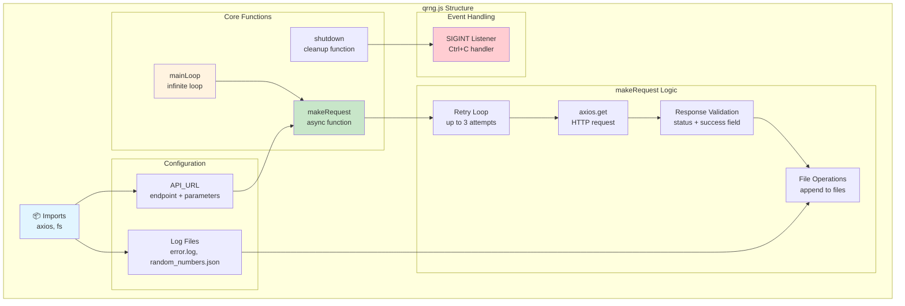
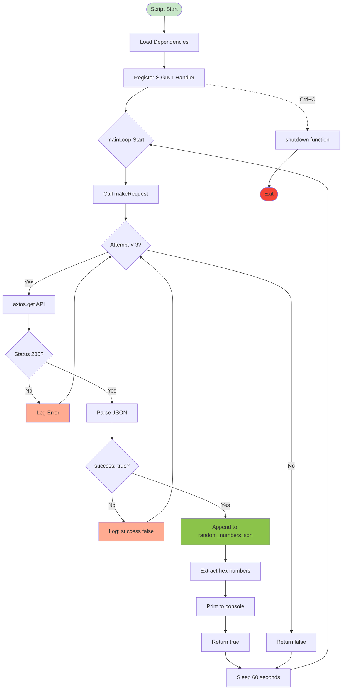

# Node.js QRNG Script - Code Walkthrough

## Overview

This Node.js implementation provides a robust, cross-platform solution for fetching quantum random numbers from the ANU QRNG API. It offers significant advantages over bash scripts for handling asynchronous operations, JSON parsing, and network requests.

## Architecture Diagram



## Key Features

Node.js implementation provides:

1. **Sends HTTP requests** to the QRNG API
2. **Handles retries** for failed requests (up to 3 attempts)
3. **Parses and logs** JSON responses
4. **Extracts and prints** hex numbers
5. **Graceful shutdown** on Ctrl+C

```javascript
const axios = require('axios');
const fs = require('fs');

const API_URL = 'https://qrng.anu.edu.au/API/jsonI.php?length=1024&type=hex16';
const ERROR_LOG_FILE = 'error.log';
const RANDOM_NUMBERS_FILE = 'random_numbers.json';

const makeRequest = async () => {
  const retries = 3;
  const delay = 2000; // 2 seconds

  for (let i = 1; i <= retries; i++) {
    console.log(`Sending request to QRNG API (Attempt ${i})...`);
    try {
      const response = await axios.get(API_URL);
      if (response.status === 200) {
        console.log(`Request successful (Status code: ${response.status})`);
        const jsonResponse = response.data;

        if (jsonResponse.success) {
          fs.appendFileSync(RANDOM_NUMBERS_FILE, JSON.stringify(jsonResponse) + '\n');
          console.log('Valid JSON response received.');
          console.log('Received JSON data:', JSON.stringify(jsonResponse, null, 2));
          console.log('Extracting hex numbers...');
          const hexNumbers = jsonResponse.data.join('\n');
          console.log(hexNumbers);
          return true;
        } else {
          console.error('Request was not successful. Success field is false.');
          fs.appendFileSync(ERROR_LOG_FILE, 'Request was not successful. Success field is false.\n');
        }
      } else {
        console.error(`Request failed or rate limit exceeded (Status code: ${response.status}).`);
        fs.appendFileSync(ERROR_LOG_FILE, `Request failed or rate limit exceeded, status code: ${response.status}\n`);
      }
    } catch (error) {
      console.error(`Request failed or rate limit exceeded (Error: ${error.message}).`);
      fs.appendFileSync(ERROR_LOG_FILE, `Request failed or rate limit exceeded, error: ${error.message}\n`);
    }

    if (i < retries) {
      console.log(`Retrying in ${delay / 1000} seconds...`);
      await new Promise(resolve => setTimeout(resolve, delay));
    }
  }

  return false;
};

const shutdown = () => {
  console.log('Shutting down... Saving any pending data and closing logs.');
  process.exit(0);
};

process.on('SIGINT', shutdown);

const mainLoop = async () => {
  while (true) {
    if (await makeRequest()) {
      console.log('Sleeping for 60 seconds before next request...');
      await new Promise(resolve => setTimeout(resolve, 60000));
    } else {
      console.log('Failed to get a valid response after 3 attempts. Sleeping for 60 seconds before next request...');
      await new Promise(resolve => setTimeout(resolve, 60000));
    }
  }
};

mainLoop();
```

## Code Breakdown

### 1. Dependencies (Lines 1-2)
```javascript
const axios = require('axios');  // HTTP client for API requests
const fs = require('fs');        // File system for logging
```

### 2. Configuration (Lines 4-6)
```javascript
const API_URL = 'https://qrng.anu.edu.au/API/jsonI.php?length=1024&type=hex16';
const ERROR_LOG_FILE = 'error.log';
const RANDOM_NUMBERS_FILE = 'random_numbers.json';
```

### 3. makeRequest Function (Lines 8-47)
**Purpose**: Attempts API request with retry logic

**Flow**:
- Retry up to 3 times with 2-second delays
- Validates HTTP 200 status
- Checks JSON `success` field
- Logs to appropriate file
- Returns `true` on success, `false` on failure

**Key Lines**:
```javascript
const response = await axios.get(API_URL);           // Line 15
if (jsonResponse.success) {                          // Line 20
  fs.appendFileSync(RANDOM_NUMBERS_FILE, ...);      // Line 21
  const hexNumbers = jsonResponse.data.join('\n');   // Line 25
}
```

### 4. shutdown Function (Lines 50-53)
**Purpose**: Graceful exit handler

Ensures pending operations complete before exit:
```javascript
const shutdown = () => {
  console.log('Shutting down...');
  process.exit(0);
};
```

### 5. SIGINT Handler (Line 55)
**Purpose**: Catch Ctrl+C keyboard interrupt

```javascript
process.on('SIGINT', shutdown);
```

### 6. mainLoop Function (Lines 57-67)
**Purpose**: Infinite request loop

**Logic**:
- Calls `makeRequest()`
- Sleeps 60 seconds between requests
- Handles both success and failure cases

```javascript
const mainLoop = async () => {
  while (true) {
    if (await makeRequest()) {
      console.log('Sleeping for 60 seconds...');
    } else {
      console.log('Failed after 3 attempts. Sleeping...');
    }
    await new Promise(resolve => setTimeout(resolve, 60000));
  }
};
```

### 7. Script Execution (Line 69)
```javascript
mainLoop();  // Start the infinite loop
```

## Execution Flow Diagram



## Advantages Over Bash

| Feature | Bash | Node.js |
|---------|------|---------|
| **Error Handling** | Basic | Comprehensive try-catch |
| **Async Operations** | Sequential | Native async/await |
| **JSON Parsing** | Requires `jq` | Built-in |
| **Cross-Platform** | POSIX only | Windows/Mac/Linux |
| **Maintenance** | Complex syntax | Readable JS |
| **Debugging** | Difficult | Rich tooling |

## Error Handling Examples

### Network Error
```javascript
catch (error) {
  console.error(`Request failed (Error: ${error.message}).`);
  fs.appendFileSync(ERROR_LOG_FILE, `error: ${error.message}\n`);
}
```

### Invalid Response
```javascript
if (!jsonResponse.success) {
  console.error('Success field is false.');
  fs.appendFileSync(ERROR_LOG_FILE, 'Success field is false.\n');
}
```

### HTTP Error
```javascript
if (response.status !== 200) {
  console.error(`Status code: ${response.status}`);
  fs.appendFileSync(ERROR_LOG_FILE, `status: ${response.status}\n`);
}
```

## Customization Examples

### Change Request Frequency
```javascript
// From 60 seconds to 30 seconds
await new Promise(resolve => setTimeout(resolve, 30000));
```

### Modify API Parameters
```javascript
// Fetch 100 uint8 values instead of 1024 hex16
const API_URL = 'https://qrng.anu.edu.au/API/jsonI.php?length=100&type=uint8';
```

### Add Additional Logging
```javascript
const SUCCESS_LOG = 'success.log';
if (jsonResponse.success) {
  fs.appendFileSync(SUCCESS_LOG, `${new Date().toISOString()} - Success\n`);
}
```

## Summary

This Node.js script provides a **robust and flexible solution** for:
- HTTP requests with automatic retries
- JSON data handling
- File-based logging
- Cross-platform compatibility
- Maintainable, readable code

**Recommended for production use** over bash alternatives due to superior error handling and async capabilities.

---

**Back to:** [Setup Guide](./readme.md) | [QRNG Module](../readme.md) | [QDMRiO Project](../../README.md)
