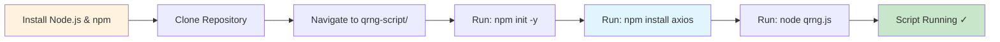

# QRNG Script Setup Guide

Quick setup instructions for the ANU QRNG Node.js script.

## Installation Flow



## Prerequisites

**Ubuntu/Debian:**
```bash
sudo apt update
sudo apt install -y nodejs npm
```

**Verify Installation:**
```bash
node -v   # Should show v16.x or higher
npm -v    # Should show 8.x or higher
```

## Setup Steps

### 1. Navigate to Script Directory
```bash
cd anuqrng/qrng-script
```

### 2. Initialize npm Project
```bash
npm init -y
```

This creates `package.json` with default settings.

### 3. Install Dependencies
```bash
npm install axios
```

Installs the HTTP client library required by `qrng.js`.

### 4. Run the Script
```bash
node qrng.js
```

Expected output:
```
Sending request to QRNG API (Attempt 1)...
Request successful (Status code: 200)
Valid JSON response received.
Received JSON data:
{
  "success": true,
  "length": 1024,
  "type": "hex16",
  "data": ["a3f2", "b4e1", ...]
}
Extracting hex numbers...
a3f2
b4e1
...
Sleeping for 60 seconds before next request...
```

### 5. Stop the Script
Press `Ctrl+C` to trigger graceful shutdown:
```
^CShutting down... Saving any pending data and closing logs.
```

## Generated Files

After running, you'll see:
- **`random_numbers.json`**: Contains successful API responses (one JSON object per line)
- **`error.log`**: Contains error messages from failed requests
- **`package.json`**: npm configuration file
- **`package-lock.json`**: Dependency lock file
- **`node_modules/`**: Installed dependencies (should be in .gitignore)

## Running in Background

### Using nohup
```bash
nohup node qrng.js &
```

Output goes to `nohup.out`. Stop with:
```bash
pkill -f "node qrng.js"
```

### Using screen
```bash
screen -S qrng
node qrng.js
```

Detach: `Ctrl+A`, then `D`
Reattach: `screen -r qrng`

### Using systemd (Recommended for Production)

Create `/etc/systemd/system/qrng.service`:
```ini
[Unit]
Description=ANU QRNG Fetcher
After=network.target

[Service]
Type=simple
User=your-username
WorkingDirectory=/path/to/QDMRiO/anuqrng/qrng-script
ExecStart=/usr/bin/node qrng.js
Restart=on-failure
RestartSec=10

[Install]
WantedBy=multi-user.target
```

Enable and start:
```bash
sudo systemctl daemon-reload
sudo systemctl enable qrng.service
sudo systemctl start qrng.service
sudo systemctl status qrng.service
```

## Configuration Options

Edit `qrng.js` to customize:

```javascript
// Line 4: API parameters
const API_URL = 'https://qrng.anu.edu.au/API/jsonI.php?length=1024&type=hex16';
//                                                              ^^^^    ^^^^^
//                                                              |       |
//                                                         Array length  Data type

// Line 9: Retry settings
const retries = 3;        // Number of retry attempts
const delay = 2000;       // Delay between retries (ms)

// Line 60: Sleep duration
await new Promise(resolve => setTimeout(resolve, 60000));
//                                                 ^^^^^
//                                            Sleep time (ms)
```

### Available Data Types
- `uint8`: 0-255
- `uint16`: 0-65535
- `hex16`: 0000-FFFF (hexadecimal)

### Example: Fetch 100 uint8 values every 30 seconds
```javascript
const API_URL = 'https://qrng.anu.edu.au/API/jsonI.php?length=100&type=uint8';
// ... (in mainLoop)
await new Promise(resolve => setTimeout(resolve, 30000)); // 30 seconds
```

## Troubleshooting

### "Module 'axios' not found"
```bash
npm install axios
```

### "Permission denied" on Linux
```bash
chmod +x qrng.js  # Not necessary for Node.js scripts, but doesn't hurt
```

### "ECONNREFUSED" or network errors
- Check internet connectivity
- Verify API is accessible: `curl https://qrng.anu.edu.au/API/jsonI.php?length=10&type=hex16`
- Check firewall settings

### Script stops unexpectedly
- Check `error.log` for details
- Verify Node.js version compatibility
- Use systemd service for automatic restart

### High CPU usage
- Increase sleep duration in `mainLoop()`
- Reduce request frequency

## Monitoring

### View logs in real-time
```bash
# Random numbers
tail -f random_numbers.json

# Errors
tail -f error.log
```

### Check file sizes
```bash
ls -lh random_numbers.json error.log
```

### Parse random numbers
```bash
# Extract just the hex values
cat random_numbers.json | jq -r '.data[]' | head -20
```

## VM-Specific Notes

**For Vagrant/Ubuntu VM:**
```bash
# Ensure VM has internet access
ping -c 3 qrng.anu.edu.au

# Check available memory
free -h

# Monitor resource usage
top  # Press 'q' to quit
```

**Port Forwarding (if needed):**
If running in VM and accessing from host, typically not needed for this script as it only makes outbound requests.

## Security Considerations

- **API Rate Limits**: Respect ANU's usage policies
- **Data Storage**: `random_numbers.json` grows indefinitely; implement rotation
- **Log Rotation**: Monitor `error.log` size

### Implement Log Rotation
```bash
# Create logrotate config: /etc/logrotate.d/qrng
/path/to/QDMRiO/anuqrng/qrng-script/*.log {
    daily
    rotate 7
    compress
    missingok
    notifempty
}
```

## Next Steps

- ✅ Script running successfully? Check [parent README](../readme.md) for integration details
- 📚 Want to understand the code? See [nodejs_example.md](./nodejs_example.md)
- 🔧 Need to modify behavior? Edit `qrng.js` and restart

---

**Back to:** [QRNG Module Documentation](../readme.md) | [QDMRiO Project](../../README.md)
