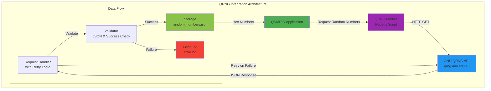
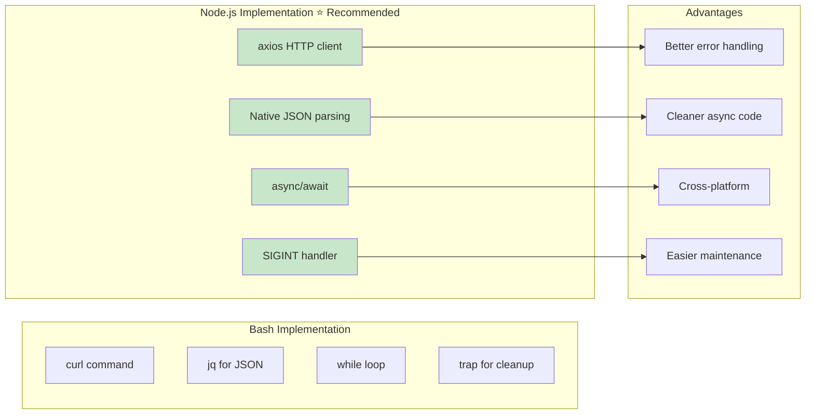
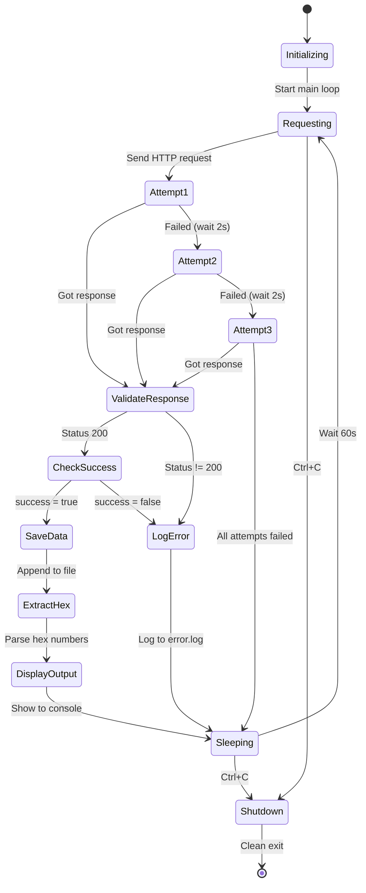
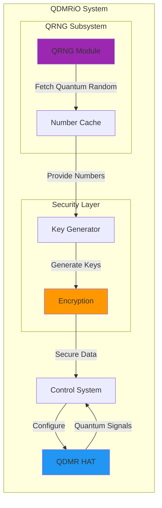

# ANU Quantum Random Number Generator (QRNG) Integration

## Overview

This module integrates with the Australian National University's Quantum Random Number Generator API to provide true quantum random numbers for the QDMRiO project. Quantum randomness is essential for secure cryptographic operations in quantum communication systems.

## Why QRNG for QDMRiO?

Quantum Dot Modulated Radio (QDMR) communication requires high-quality random numbers for:
- **Key Generation**: Secure encryption keys for quantum communication
- **Signal Randomization**: Enhanced security through unpredictable signal patterns
- **Quantum Protocol Implementation**: Various quantum cryptography protocols

## Architecture



## Script Operation Flow

```mermaid
sequenceDiagram
    participant Script as QRNG Script
    participant API as ANU API
    participant FS as File System
    participant Console

    loop Every 60 seconds
        Script->>Console: Log "Sending request..."

        loop Retry up to 3 times
            Script->>API: GET /API/jsonI.php?length=1024&type=hex16

            alt Status 200 & Success True
                API-->>Script: JSON {success: true, data: [...]}
                Script->>Console: Log "Request successful"
                Script->>FS: Append to random_numbers.json
                Script->>Console: Display JSON data
                Script->>Console: Display hex numbers
                break Success
            else Status 200 & Success False
                API-->>Script: JSON {success: false}
                Script->>FS: Log error to error.log
                Script->>Console: Log "Success field is false"
            else Status != 200 or Error
                API-->>Script: Error / Non-200 status
                Script->>FS: Log error to error.log
                Script->>Console: Log "Request failed"
                Script->>Script: Wait 2 seconds
            end
        end

        Script->>Console: Log "Sleeping 60 seconds..."
        Script->>Script: Sleep 60 seconds
    end

    Note over Script: Ctrl+C triggers graceful shutdown
```

## Implementation Comparison

### Bash Script vs Node.js



## Features

### ✅ Implemented
- **Retry Mechanism**: Up to 3 attempts with 2-second delays
- **Error Handling**: Comprehensive logging to `error.log`
- **Success Validation**: Checks both HTTP status and JSON `success` field
- **Data Persistence**: Appends valid responses to `random_numbers.json`
- **Hex Extraction**: Parses and displays hex numbers from API response
- **Graceful Shutdown**: Ctrl+C handler for clean termination
- **Console Output**: Real-time feedback for all operations

### API Endpoint Details

**Base URL**: `https://qrng.anu.edu.au/API/jsonI.php`

**Parameters**:
- `length`: Number of random values (1024 in current implementation)
- `type`: Data type (`hex16` = hexadecimal 0000-FFFF)
- `size`: Optional block size

**Response Format**:
```json
{
  "success": true,
  "length": 1024,
  "type": "hex16",
  "data": ["a3f2", "b4e1", "c5d0", ...]
}
```

## State Machine



## Quick Start

See [qrng-script/readme.md](./qrng-script/readme.md) for detailed setup instructions.

**TL;DR**:
```bash
cd anuqrng/qrng-script
npm install
node qrng.js
```

## Files in This Module

- **`qrng.js`**: Main Node.js implementation
- **`readme.md`**: Setup and installation instructions
- **`nodejs_example.md`**: Detailed script explanation and code walkthrough
- **`random_numbers.json`**: Output file (auto-generated, one JSON per line)
- **`error.log`**: Error log file (auto-generated)

## Integration with QDMRiO



## API Rate Limits & Best Practices

⚠️ **Rate Limiting**: The ANU QRNG API has usage limits:
- Default script requests every 60 seconds (well within limits)
- Each request fetches 1024 hex16 values
- Implement local caching for high-frequency applications

**Best Practices**:
1. Cache random numbers locally
2. Use exponential backoff for retries
3. Monitor `error.log` for API issues
4. Implement fallback to pseudorandom if API unavailable

## Troubleshooting

### Common Issues

| Issue | Cause | Solution |
|-------|-------|----------|
| Status 500 | Server error | Retry mechanism handles this automatically |
| Success: false | Rate limit / API issue | Check error.log, wait longer between requests |
| Connection error | Network issue | Verify internet connectivity |
| jq errors (Bash) | Invalid JSON | Switch to Node.js implementation |

## Further Reading

- [ANU QRNG API Documentation](https://qrng.anu.edu.au/API/api-demo.php)
- [Quantum Random Number Generation](https://en.wikipedia.org/wiki/Hardware_random_number_generator#Quantum_random_number_generators)
- [Node.js Script Details](./qrng-script/nodejs_example.md)

---

**Part of the [QDMRiO Project](../README.md)**
